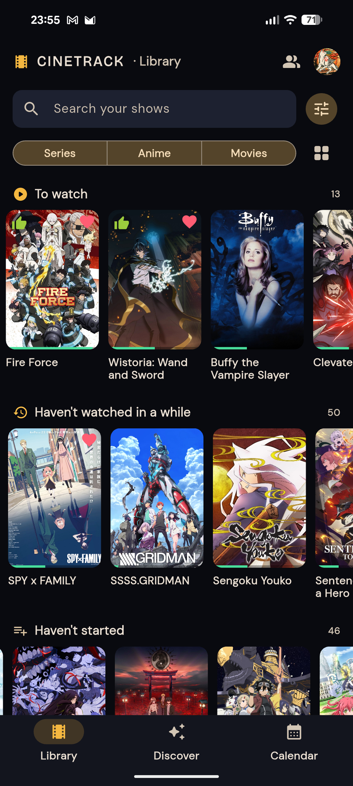
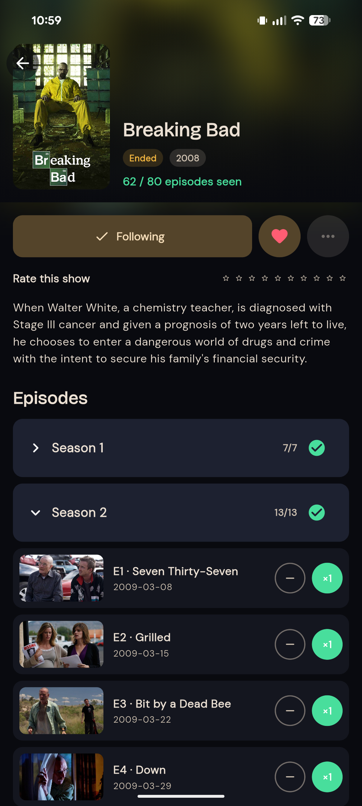
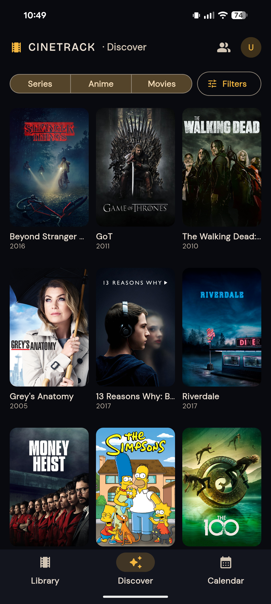
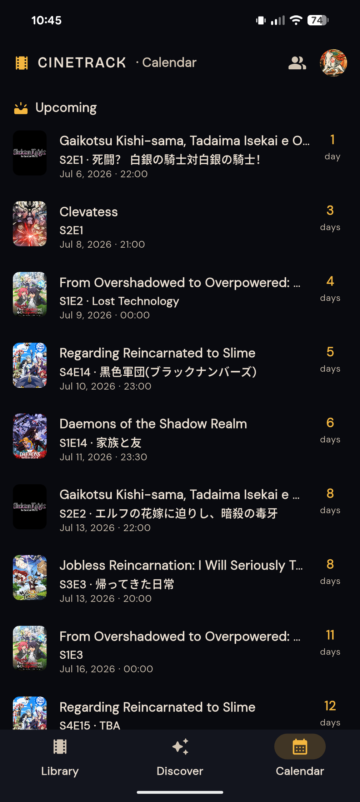
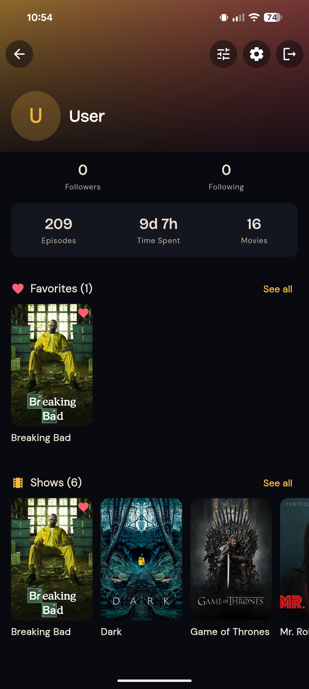

<div align="center">

# 🎬 Cinetrack

**A self-hosted, open-source TV & movie tracker.**

Track series, movies and anime · mark episodes watched · rate & favorite ·
follow friends · discover what to watch next - all on infrastructure you own.

Cinetrack is a spiritual successor to **[TV Time](https://en.wikipedia.org/wiki/TV_Time)**,
the beloved tracking app that shut down. It's built to be run by anyone, on a single
small server, with no external SaaS dependencies. Metadata comes from
**[TheTVDB](https://thetvdb.com)**, mirrored locally so the app stays fast and resilient.

[](LICENSE)


</div>

<!-- --- -->

<!-- ## Screenshots

<div align="center">

|               Library               |                 Show detail                 |               Discover                |
| :---------------------------------: | :-----------------------------------------: | :-----------------------------------: |
|  |  |  |

|               Calendar                |           Profile & stats           |              Mobile               |
| :-----------------------------------: | :---------------------------------: | :-------------------------------: |
|  |  |  |

</div> -->

---

## What is Cinetrack?

Cinetrack is a complete, **fully open-source** app for tracking what you watch: TV series,
movies and anime. Both the **backend** (a Rust API) and the **frontend** (a Flutter app for
web, Android and iOS) are open and self-hostable, with no proprietary cloud component; you run
the whole thing.

It was built because TV Time closed and left a gap: a polished, social, cross-platform way
to keep track of everything you watch. Cinetrack imports your old **TV Time GDPR export**,
so you don't lose your history.

### Features

- **Track everything** - series, movies and anime, with per-episode watch history and
  rewatch counts.
- **Organize your library** - following, favorites, "for later", and stop/archive states,
  auto-categorized into Watching / Up to date / Stale / Not started / Stopped.
- **Rate & review** - 1-10 ratings per show.
- **Social** - follow other users, accept/decline follow requests, private profiles, a feed
  of friends' activity, and invitations.
- **Discover & filter** - advanced filtering by genre, tag, network, studio, year, runtime,
  language, country, and more; trigram-powered fuzzy search across titles and translations.
- **Calendar** - recently aired and upcoming episodes for the shows you follow.
- **Stats** - episodes watched, time spent, and viewing patterns.
- **Multi-language UI** - 9 locales (en, fr, de, es, it, ja, ko, pt, zh).
- **Import from TV Time** - one command loads your GDPR export (users, shows, ~11k+ watch
  events, ratings, favorites), idempotently.

### Tech stack

| Layer                   | Technology                                                                                                                                  |
| ----------------------- | ------------------------------------------------------------------------------------------------------------------------------------------- |
| **Backend**             | Rust - [axum](https://github.com/tokio-rs/axum) (HTTP), [sqlx](https://github.com/launchbadge/sqlx) (Postgres), Argon2id auth, JWT sessions |
| **Frontend**            | [Flutter](https://flutter.dev) - one codebase for Web, Android and iOS                                                                      |
| **Database**            | PostgreSQL 17 (with `pg_trgm` for fuzzy search)                                                                                             |
| **Object storage**      | [Garage](https://garagehq.deuxfleurs.fr) - S3-compatible, single Rust binary (avatars & covers)                                             |
| **Metadata**            | [TheTVDB](https://thetvdb.com) v4 API, mirrored locally as a read-through cache                                                             |
| **Reverse proxy / TLS** | [Caddy](https://caddyserver.com) behind [Cloudflare](https://www.cloudflare.com)                                                            |
| **Orchestration**       | Docker Compose                                                                                                                              |

---

## Quick start (development)

You need Docker, and a free/commercial **[TheTVDB API key](https://thetvdb.com/api-information)**.

```bash
git clone https://github.com/Shiranuit/Cinetrack.git
cd Cinetrack

# 1. Configure - copy the template and fill in secrets.
cp .env.example .env
#   Set THETVDB_API_KEY and JWT_SECRET; generate secrets with: openssl rand -hex 32
#   (JWT_SECRET, GARAGE_RPC_SECRET, GARAGE_ADMIN_TOKEN)

# 2. Start the datastores.
docker compose up -d postgres garage

# 3. Bootstrap object storage (prints S3 keys - paste them into .env).
./scripts/garage-init.sh

# 4. Start the backend (runs DB migrations on boot).
docker compose up -d --build backend

# 5. Smoke test.
curl localhost:8080/health

# 6. Run the Flutter web app against it.
cd frontend && flutter run -d chrome
```

Full walkthrough (prerequisites, running the backend on the host, the Flutter app, building
APK/web): **[docs/installation.md](docs/installation.md)**.

---

## Documentation

| Doc                                        | What's inside                                                                              |
| ------------------------------------------ | ------------------------------------------------------------------------------------------ |
| **[Installation](docs/installation.md)**   | Dev setup, running the backend & Flutter app, building web/APK.                            |
| **[Configuration](docs/configuration.md)** | Every environment variable, catalog/sync modes, and the profiling flags.                   |
| **[Deployment](docs/deployment.md)**       | The production single-server, self-contained stack behind Cloudflare - and its trade-offs. |
| **[CI / CD](docs/ci-cd.md)**               | The GitHub Actions workflows and the exact secrets/variables a fork must set.              |
| **[CLI & scripts](docs/cli.md)**           | Admin binaries (create user, import, mirror, sync…) and the ops scripts.                   |
| **[Architecture](docs/architecture.md)**   | How the mirror, sync, data model, storage and auth fit together.                           |

---

## Deployment in one paragraph

The included **[production Docker Compose](production.docker-compose.yaml)** stands up the
_entire_ application - API, web app, PostgreSQL, object storage, and a mail relay - on a
**single Linux server**, behind **Cloudflare**, with **no external managed services**. It's
designed to be **low-cost and self-contained**, not industrial-grade: everything runs on one
box, so it's simple and cheap but doesn't scale horizontally and has no built-in HA. It's a
great fit for personal or small-community use. See **[docs/deployment.md](docs/deployment.md)**
for the full guide, including the recommendation to use a real transactional-email provider
instead of self-hosting mail.

---

## Project structure

```
.
├── backend/          Rust API server (axum + sqlx) - src/, migrations/, tests/, Dockerfile
├── frontend/         Flutter app (web + mobile) - lib/, Caddyfile, Dockerfile
├── scripts/          Ops scripts (garage-init, db-*, create-user, firewall, mail-dkim…)
├── deploy/           systemd units for the Cloudflare-only firewall
├── docs/             The documentation you're reading
├── garage/           Garage (S3) node config
├── docker-compose.yml            Dev stack
└── production.docker-compose.yaml  Production single-server stack
```

---

## Contributing

Contributions are welcome. Open an issue to discuss substantial changes first. The backend
must pass `cargo test` (with a `postgres-test` container up) and the frontend `flutter analyze`
- both run in CI on every pull request.

---

## License & name

Cinetrack is licensed under the **[Apache License 2.0](LICENSE)** - you may use, modify,
self-host and redistribute it, including commercially.

**The "Cinetrack" / "cine-track" name, logo and icon are reserved** (Apache 2.0 grants no
trademark rights - see [NOTICE](NOTICE)). Please **rename your fork or instance**; don't use
the Cinetrack name/branding in a way that implies it's the official project or endorsed by it.
Saying your project "is based on Cinetrack" is fine.

## Acknowledgements

- **[TV Time](https://en.wikipedia.org/wiki/TV_Time)** - the inspiration; Cinetrack exists to
  fill the void it left.
- **[TheTVDB](https://thetvdb.com)** - the metadata source. Metadata provided by TheTVDB.
  Please consider [subscribing or contributing](https://thetvdb.com/subscribe) to support them.

> Cinetrack is not affiliated with, endorsed by, or sponsored by TheTVDB or TV Time / Whip Media.
